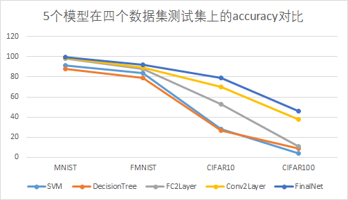

# 多种神经网络在多种图像分类任务上的性能对比以及对神经网络的优化

## 目录介绍

```txt
│  README.md
│
├─code				# 代码包
│  models.py 	 	 	# 三个神经网络模型
│  run.py		 	# 神经网络模型的测试
│  TraditionalModels.py 	# 传统模型，SVM和DecisionTree的测试
│
├─datasets  			# 数据集
│  ├─cifar-10-batches-py
│  ├─cifar-100-python
│  ├─FashionMNIST
│  └─MNIST
│
├─log 				# 模型运行产生的日志文件（最优的部分）
│      Conv2Layer_CIFAR100_02-18-20-24-25.txt
│      Conv2Layer_CIFAR10_02-18-14-22-00.txt
│      Conv2Layer_FMNIST_02-18-19-16-41.txt
│      Conv2Layer_MNIST_02-18-19-16-54.txt
│      DecisionTree_CIFAR100_02-18-20-32-55.txt
│      DecisionTree_CIFAR10_02-18-18-32-50.txt
│      DecisionTree_FMNIST_02-18-18-31-37.txt
│      DecisionTree_MNIST_02-18-18-30-49.txt
│      FC2Layer_CIFAR100_02-18-20-23-36.txt
│      FC2Layer_CIFAR10_02-18-19-32-51.txt
│      FC2Layer_FMNIST_02-18-20-06-01.txt
│      FC2Layer_MNIST_02-18-20-14-34.txt
│      FinalNet_CIFAR100_02-19-09-57-13.txt
│      FinalNet_CIFAR10_02-19-10-48-29.txt
│      FinalNet_FMNIST_02-19-10-12-15.txt
│      FinalNet_MNIST_02-19-10-29-50.txt
│      SVM_CIFAR100_02-18-21-49-30.txt
│      SVM_CIFAR10_02-18-16-53-43.txt
│      SVM_FMNIST_02-18-15-46-38.txt
│      SVM_MNIST_02-18-15-45-06.txt
│
└─saved_model			# 三个神经网络模型，保存的最优的模型
    ├─Conv2Layer
    │      CIFAR10.bin
    │      CIFAR100.bin
    │      FMNIST.bin
    │      MNIST.bin
    │
    ├─FC2Layer
    │      CIFAR10.bin
    │      CIFAR100.bin
    │      FMNIST.bin
    │      MNIST.bin
    │
    └─FinalNet
            CIFAR10.bin
            CIFAR100.bin
            FMNIST.bin
            MNIST.bin
```

## 神经网络

### train

```cmd
cd code
python run.py ^
      --do_train ^
      --do_test ^
      --model FC2Layer ^
      --model_path ../saved_model/ ^
      --dataset FMNIST ^
      --train_batch_size 64 ^
      --test_batch_size 64 ^
      --with_cuda ^
      --lr 0.99 ^
      --epoch 20
```

- 模型

> 以上指令中训练的是FC2Layer模型，还支持Conv2Layer和FinalNet，只需将model参数改为相应的模型即可

- 数据集

> 以上为MNIST数据集示例，还可支持FMNIST，CIFAR10和CIFAR100，只需将
> dataset 参数改为相应的数据集即可

- GPU

> 通过使用 with_cuda 参数可以使用GPU

### test

```cmd
cd code
python run.py ^
      --do_test ^
      --do_valid ^
      --model FC2Layer ^
      --model_path ../saved_model/ ^
      --dataset MNIST ^
      --test_batch_size 64 ^
      --with_cuda
```

## SVM

```cmd
python TraditionalModels.py ^
    --model SVM ^
    --dataset CIFAR100 ^
    --datasets_path ../datasets/ ^
    --log_path ../log/ ^
    --max_iter 5
  
```

## DecisionTree

```cmd
python TraditionalModels.py ^
    --model DecisionTree ^
    --dataset CIFAR100 ^
    --datasets_path ../datasets/ ^
    --log_path ../log/

```

## performances
### FC2Layer

|                            | MNIST          | FMNIST         | CIFAR10        | CIFAR100       |
| -------------------------- | -------------- | -------------- | -------------- | -------------- |
| accuracy on validation set | 98.67%         | 89.08%         | 53.68%         | 11.02%         |
| accuracy on testing set    | 98.46%         | 87.93%         | 52.84%         | 10.95%         |
| trainning and testing time | 0:06:32.037139 | 0:06:43.048282 | 0:07:50.947157 | 0:07:58.464643 |

### Conv2Layer

|                            | MNIST          | FMNIST         | CIFAR10        | CIFAR100       |
| -------------------------- | -------------- | -------------- | -------------- | -------------- |
| accuracy on validation set | 98.98%         | 89.50%         | 71.06%         | 37.44%         |
| accuracy on testing set    | 98.80%         | 89.51%         | 70.11%         | 38.00%         |
| trainning and testing time | 0:06:49.380993 | 0:06:51.870009 | 0:07:19.040515 | 0:07:32.302949 |

### FinalNet

|                            | MNIST          | FMNIST         | CIFAR10        | CIFAR100       |
| -------------------------- | -------------- | -------------- | -------------- | -------------- |
| accuracy on validation set | 99.43%         | 92.27%         | 80.62%         | 46.02%         |
| accuracy on testing set    | 99.44%         | 91.77%         | 78.89%         | 45.99%         |
| trainning and testing time | 0:16:08.398272 | 0:16:04.926395 | 0:13:53.092453 | 0:13:56.121392 |

### SVM

|                            | MNIST          | FMNIST         | CIFAR10        | CIFAR100       |
| -------------------------- | -------------- | -------------- | -------------- | -------------- |
| accuracy on testing set    | 91.83%         | 84.03%         | 28.07%         | 3.83%          |
| trainning and testing time | 0:00:37.411248 | 0:01:17.616421 | 0:51:49.357428 | 0:58:55.113844 |

### DecisionTree

|                            | MNIST          | FMNIST         | CIFAR10        | CIFAR100       |
| -------------------------- | -------------- | -------------- | -------------- | -------------- |
| accuracy on testing set    | 87.71%         | 78.88%         | 26.87%         | 8.46%          |
| trainning and testing time | 0:00:18.872370 | 0:00:38.006813 | 0:02:58.098092 | 0:08:40.131943 |

### 准确率(accuracy)



### 时间

